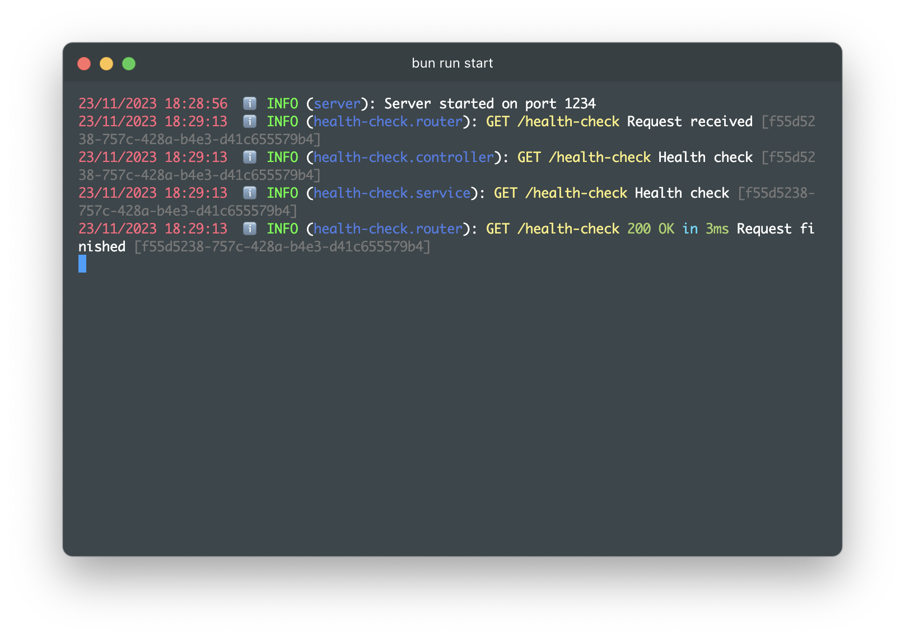

[](https://github.com/CBSRdev/bun-typescript/actions/workflows/main.yml)
[](https://opensource.org/licenses/MIT)

# Bun template with TypeScript


This is a template for [Bun](
    https://bun.sh/
) with [TypeScript](
    https://www.typescriptlang.org/
).

## Usage

```bash
$ bun run test
$ bun start
```

## Creating a Domain
```bash
$ bun run create:domain <name>
```

And then you can create files under `src/apps/:name`.
The script will add to `tsconfig.json` automatically under `paths` as 
```json
    "@<name>/<entity>/*": ["src/apps/<name>/<entity>/*"],
```

## Features

1. [TypeScript](https://www.typescriptlang.org/)
2. [ESLint](https://eslint.org/)
3. [Docker](https://www.docker.com/)
4. [Docker Compose](https://docs.docker.com/compose/)
5. [PostgreSQL](https://www.postgresql.org/)
6. [Redis](https://redis.io/)
7. [TypeORM](https://typeorm.io/)
10. [Elysia](https://elysiajs.com/)

## Structure

```
.
├── README.md
├── bun.config.ts
├── docker-compose.yml
├── package.json
├── src
│   ├── apps
│   │   ├── <domain>
│   │   │   ├── adapters
│   │   │   │   ├── http
│   │   │   │   │   ├── controllers
│   │   │   │   │   │   └── <entity>.controller.ts
│   │   │   │   │   └── routes
│   │   │   │   │   │   └── <entity>.route.ts
│   │   │   │   |   └── views
│   │   │   │   │   │   └── request
│   │   │   │   │   │   │   └── <entity>.requests.ts
│   │   │   │   │   │   └── response
│   │   │   │   │   │       └── <entity>.responses.ts
│   │   │   ├── repositories
│   │   │   │   └── <entity>.repository.ts
│   │   │   ├── applications
│   │   │   │   └── <entity>.service.ts
│   │   │   ├── models
│   │   │   │   └── <entity>.model.ts
│   ├── config
│   ├── commons
│   ├── errors
│   ├── logger
│   ├── server

```

## TODO
- [ ] Add tests to increase coverage to 100%